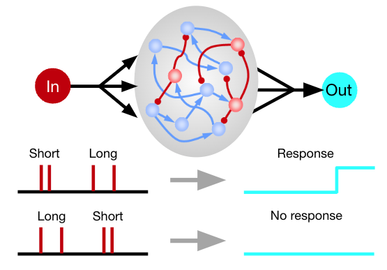
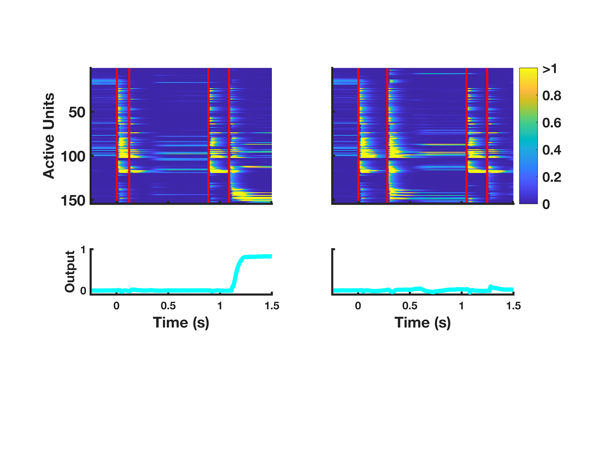
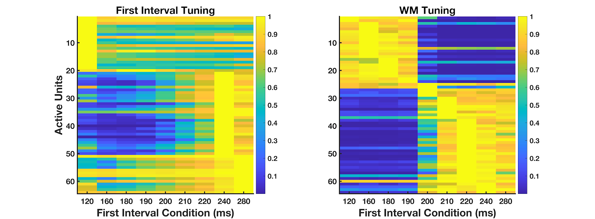
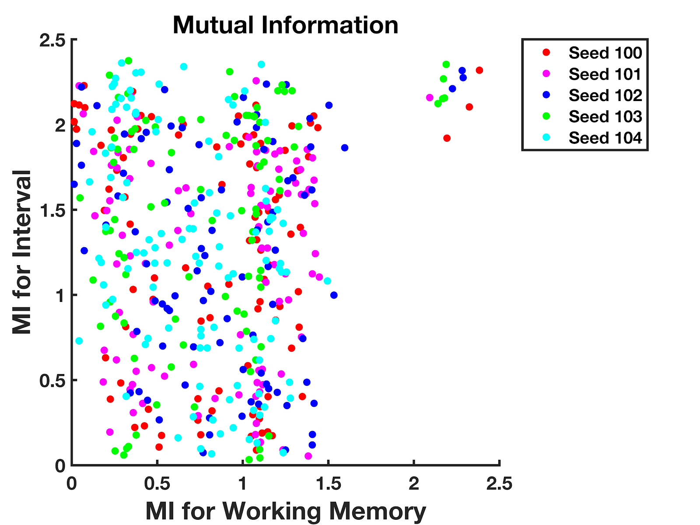

## Interval Timing
Code for 2-Interval Forced Choice task trained on an RNN with biologically feasible parameters.

This code was used to train the network described in the publication, [_A Recurrent Neural Network Model Accounts for Both Timing and Working Memory Components of an Interval Discrimination Task_](https://brill.com/view/journals/time/11/1-4/article-p220_009.xml).

## Abstract
Interval discrimination is of fundamental importance to many forms of sensory processing, including speech and music. Standard interval discrimination tasks require comparing two intervals separated in time, and thus include both working memory (WM) and timing components. Models of interval discrimination invoke separate circuits for the timing and WM components. Here we examine if, in principle, the same recurrent neural network can implement both. Using human psychophysics, we first explored the role of the WM component by varying the interstimulus delay. Consistent with previous studies, discrimination was significantly worse for a 250 ms delay, compared to 750 and 1500 ms delays, suggesting that the first interval is stably stored in WM for longer delays. We next successfully trained a recurrent neural network (RNN) on the task, demonstrating that the same network can implement both the timing and WM components. Many units in the RNN were tuned to specific intervals during the sensory epoch, and others encoded the first interval during the delay period. Overall, the encoding strategy was consistent with the notion of mixed selectivity. Units generally encoded more interval information during the sensory epoch than in the delay period, reflecting categorical encoding of short versus long in WM, rather than encoding of the specific interval. Our results demonstrate that, in contrast to standard models of interval discrimination that invoke a separate memory module, the same network can, in principle, solve the timing, WM, and comparison components of an interval discrimination task.

## Selected figures

  
   
  <em style="font-size: 10;">Schematic of RNN model. The input unit projects to the RNN composed of 256 units (204 excitatory, 52 inhibitory). The recurrent units project to the output unit. The network is trained to produce a motor response for trials in which the first interval is longer than the second interval following the offset of the second interval.</em>

  
   
  <em style="font-size: 10;">Sample population activity of a trained RNN tested on two different trial conditions. Red bars indicate input pulses. Left panel shows network activity for the short interval (120 ms) followed by the standard interval (200 ms) case, and right panel shows network activity for long-standard case. Cyan plots represent activity of the output unit.
</em>

  
   
  <em style="font-size: 10;">(A) Tuning to first interval. Each row represents a single unit’s tuning function across all 9 possible first interval conditions during the sensory epoch. The units are sorted in order of interval tuning, with the units tuned to the shorter intervals shown first. Only the top quartile  of active units are shown. (B) Tuning to working memory of first interval. Each row represents a unit’s tuning function across all 9 possible first interval conditions during the WM epoch. The units are sorted in order of interval tuning, with the units tuned to the shorter intervals shown first. Only the top quartile of active units are shown. 
</em>

  
   
  <em style="font-size: 10;">Scatter plot of the mutual information of each active unit to the working memory of the interval compared to the timing of the first interval. 
</em>

